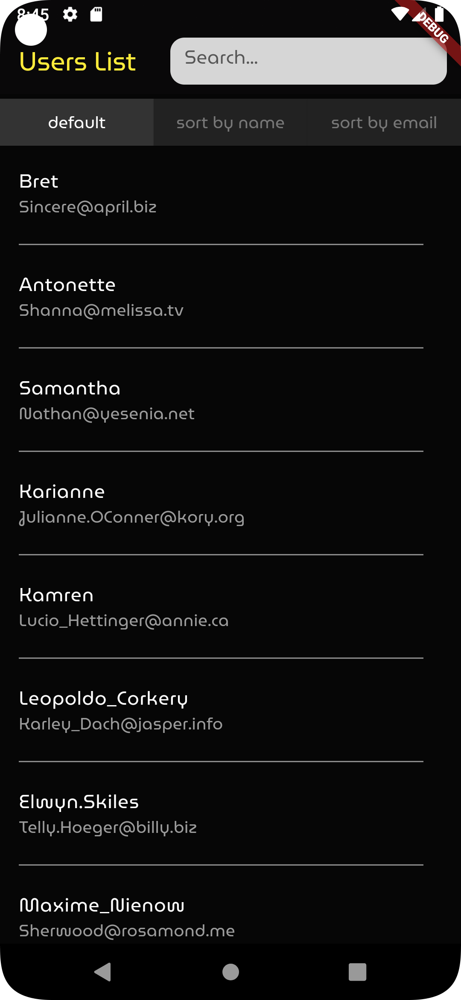
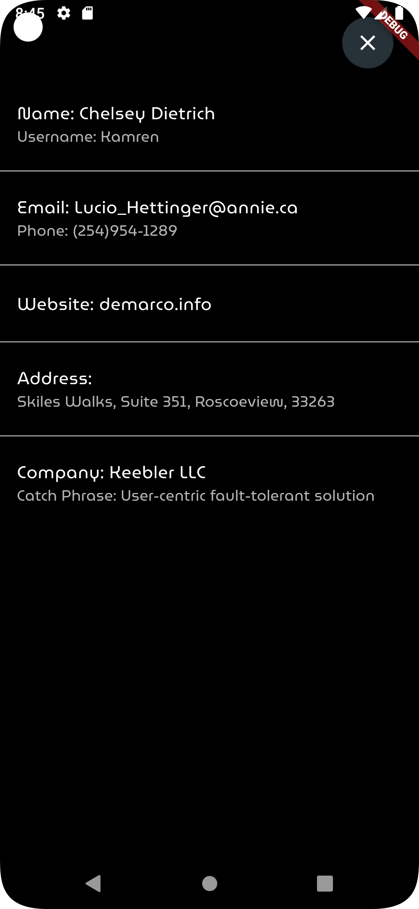

# Homework

This is a simple Flutter app demonstrating HTTP request, list views, filtering, sorting, and navigation. It serves as a demonstration of skills during the hiring process.

## Features

- Fetches a list of objects from an HTTP endpoint.
- Displays the fetched objects in a ListView.
- Provides a text field to filter the displayed elements.
- Offers three sorting options: Default, Name, and Email.
- Navigates to a detail screen when an element is clicked, displaying all details of the selected element.

## Screenshots

<div style="display: flex; justify-content: space-around; padding: 0 10%;">
  
  
</div>

## Getting Started

### Prerequisites

- [Flutter](https://flutter.dev/docs/get-started/install) installed on your local machine.

### Installation

1. Clone the repository:
    ```sh
    git clone https://github.com/StepanFriedl/homework.git
    ```
2. Navigate to the project directory:
    ```sh
    cd homework
    ```
3. Install the dependencies:
    ```sh
    flutter pub get
    ```

### Running the App

1. Run the app on an emulator or connected device:
    ```sh
    flutter run
    ```

## Code Structure

- `main.dart`: The entry point of the application.
- `lib/classes`
  - `address.dart`: Class for address details.
  - `company.dart`: Class for company details.
  - `user.dart`: Class for user details.
- `lib/screens`
  - `detail_screen.dart`: Contains the detail screen showing the details of the selected user.
  - `users_list.dart`: Contains the home screen with the list view, filter text field, and sorting buttons.
- `lib/widgets`
  - `sort_buttons.dart`: Contains the widget for the sorting buttons.
- `fonts`: Directory for fonts.
- `screenshots`: Directory holding screenshots for `README.md`.

## How to Use

1. Launch the app to see the home screen.
2. The app performs an HTTP request and fetches a list of objects.
3. Use the text field at the top to filter the list based on the text input.
4. Use the sorting buttons to sort the list by default, name, or email. The selected sorting option will have a different look.
5. Click any button in the list to navigate to the detail screen, displaying all details of the selected element.
6. Use the close button in the top right section of the detail screen to return to the home screen.

## Contributing

Contributions are welcome! Please open an issue or submit a pull request for any improvements or bug fixes.

## License

This project is licensed under the MIT License - see the [LICENSE](LICENSE) file for details.

## Contact

For any questions or feedback, please contact [stepanfriedl13@gmail.com](mailto:stepanfriedl13@gmail.com).
